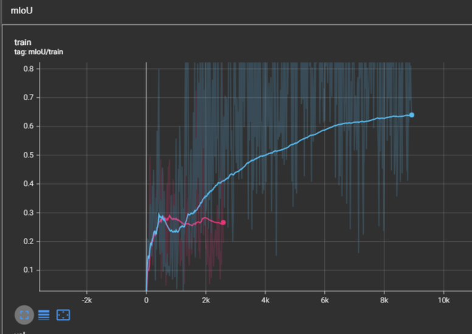

an image segmentation model designed by me using the swin-v2-t transformer classifier as a backbone, a feature pyramid network, lion optimizer, and deep supervised training (using auxiliary layers for loss)

## current

tried using boundary refinement module (sobel kernel) to
improve IoU score (0.66 on pascal voc 2012) but i think it may have 
just added noise:

with boundary-module (purple), without (blue)

## older ver

training for swin-based fpn segmentation model: experienced irrecoverable loss at 2k steps. Pixel accuracy: 0.75, miou: 0.25

